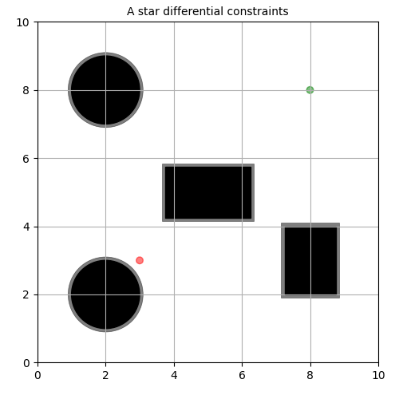
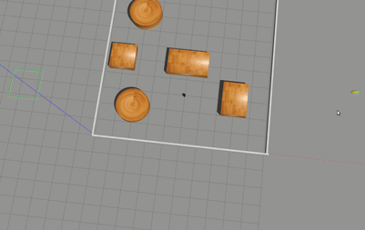

# AStar- with non holonomic constraints.

## Authors
```
Name: Shailesh Pranav Rajendran
- UID: 118261997
- Section: 0201

Github link: https://github.com/shaileshpranav/ENPM661_Prj3/tree/main/Phase%202
```

#  Part1: Visualization in Matplotlib 
Run 

    python3 Astar_ddc.py 

Start and goal positions can be passed as arguments.

### Example:
    python3 Astar_ddc.py --init_state "1,1,0" --goal_state "9,9,0" --rpms "5,10"





---------------------------------------------------
# Part2:  Visualization in Gazebo.

###  ROS package:
Refer the folder `./ros` for the ros package `astar_ddc`. Paste the ros package in your src folder of catkin workspace.

### Dependancies. 
run the following, to setup the dependancies in the catkin workspace- `catkin_ws`.

    cd ~/ros_catkin_ws/src
    
    git clone https://github.com/ROBOTIS-GIT/turtlebot3_msgs.git
    git clone https://github.com/ROBOTIS-GIT/turtlebot3.git
    git clone https://github.com/ROBOTIS-GIT/turtlebot3_simulations.git

make sure to paste this in `.bashrc` -   export TURTLEBOT3_MODEL=burger 

Run 

      cd ~/catkin_ws && catkin_make

The following scripts are in the package's folder `astar_ddc/src` 
-  `Astart_ddc.py`
- `arena.py` 
-  `utils.py` 
- `open_loop.py` 

The node `publisher.py` is used to call the Astar planner to make the plan and obtain the waypoints. 
We have an `open loop publisher` that can apply the actions to the turtlebot.

To execute, run the command,

    roslaunch astar_ddc enviroment.launch x_init:=6 y_init:=8 theta_init:=0 x_final:=9 y_final:=9 rpm1:=15 rpm2:=10 





# Results:
For part 1, refer the following videos.

    3,3,0.mp4
    1,1,0.mp4

For part 2, refer the following videos.  

    530-990.mp4
    680-990.mp4


# Structure:

    
    ├── 2D
        ├── arena.py
        ├── Astar_ddc.py
        ├── utils.py
    ├── assets
    │   ├── <visuals>.gif
    ├── output
    │   ├── <results videos>.mp4
    ├── README.md
    └── 3D
        └── astar_ddc

